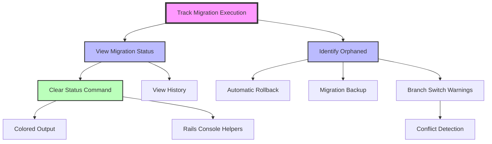

# Rails Migration Guard - Visual Story Map

## Story Map Structure

```
┌─────────────────────────────────────────────────────────────────────────────────────────┐
│                            RAILS MIGRATION GUARD - USER STORY MAP                        │
├─────────────────────────────────────────────────────────────────────────────────────────┤
│                                                                                         │
│  USER        ┌──────────────┐ ┌──────────────┐ ┌──────────────┐ ┌──────────────┐     │
│  ACTIVITIES  │    SETUP     │ │    TRACK     │ │   MANAGE     │ │ COLLABORATE  │     │
│              └──────────────┘ └──────────────┘ └──────────────┘ └──────────────┘     │
│                                                                                         │
│  EPICS       ┌──────────────┐ ┌──────────────┐ ┌──────────────┐ ┌──────────────┐     │
│              │     CORE     │ │      DX      │ │    SAFETY    │ │     TEAM     │     │
│              │  TRACKING    │ │  EXPERIENCE  │ │  & RECOVERY  │ │COLLABORATION │     │
│              └──────────────┘ └──────────────┘ └──────────────┘ └──────────────┘     │
│                                                                                         │
│  ─ ─ ─ ─ ─ ─ ─ ─ ─ ─ ─ ─ ─ ─ ─ ─ RELEASE 1.0 ─ ─ ─ ─ ─ ─ ─ ─ ─ ─ ─ ─ ─ ─ ─ ─ ─      │
│                                                                                         │
│  HIGH        ┌──────────────┐ ┌──────────────┐ ┌──────────────┐                       │
│  PRIORITY    │Track Migration│ │Clear Status │ │Branch Switch │                       │
│              │  Execution   │ │   Command    │ │  Warnings    │                       │
│              │    (3 pts)   │ │   (2 pts)    │ │   (3 pts)    │                       │
│              └──────────────┘ └──────────────┘ └──────────────┘                       │
│                                                                                         │
│              ┌──────────────┐                  ┌──────────────┐                       │
│              │View Migration│                  │  Automatic   │                       │
│              │   Status     │                  │  Rollback    │                       │
│              │   (2 pts)    │                  │   (5 pts)    │                       │
│              └──────────────┘                  └──────────────┘                       │
│                                                                                         │
│              ┌──────────────┐                  ┌──────────────┐                       │
│              │  Identify    │                  │  Migration   │                       │
│              │  Orphaned    │                  │   Backup     │                       │
│              │   (3 pts)    │                  │   (3 pts)    │                       │
│              └──────────────┘                  └──────────────┘                       │
│                                                                                         │
│  ─ ─ ─ ─ ─ ─ ─ ─ ─ ─ ─ ─ ─ ─ ─ ─ RELEASE 1.1 ─ ─ ─ ─ ─ ─ ─ ─ ─ ─ ─ ─ ─ ─ ─ ─ ─      │
│                                                                                         │
│  MEDIUM      ┌──────────────┐ ┌──────────────┐ ┌──────────────┐ ┌──────────────┐     │
│  PRIORITY    │   View       │ │   Colored    │ │   Conflict   │ │    Shared    │     │
│              │  History     │ │   Output     │ │  Detection   │ │   Status     │     │
│              │  (2 pts)     │ │   (1 pt)     │ │   (3 pts)    │ │   (5 pts)    │     │
│              └──────────────┘ └──────────────┘ └──────────────┘ └──────────────┘     │
│                                                                                         │
│                               ┌──────────────┐                  ┌──────────────┐     │
│                               │Rails Console │                  │      PR      │     │
│                               │   Helpers    │                  │ Integration  │     │
│                               │   (2 pts)    │                  │   (3 pts)    │     │
│                               └──────────────┘                  └──────────────┘     │
│                                                                                         │
│  ─ ─ ─ ─ ─ ─ ─ ─ ─ ─ ─ ─ ─ ─ ─ ─ RELEASE 2.0 ─ ─ ─ ─ ─ ─ ─ ─ ─ ─ ─ ─ ─ ─ ─ ─ ─      │
│                                                                                         │
│  LOW                          ┌──────────────┐                  ┌──────────────┐     │
│  PRIORITY                     │     IDE      │                  │  Migration   │     │
│                               │ Integration  │                  │  Comments    │     │
│                               │   (5 pts)    │                  │   (2 pts)    │     │
│                               └──────────────┘                  └──────────────┘     │
│                                                                                         │
│                                                                 ┌──────────────┐     │
│                                                                 │    Team      │     │
│                                                                 │Notifications │     │
│                                                                 │   (3 pts)    │     │
│                                                                 └──────────────┘     │
│                                                                                         │
│              ┌────────────────────────────────────────────────────────────────┐       │
│  ADVANCED    │  Multi-DB  │  Custom   │  Migration  │   Data Migration        │       │
│  FEATURES    │  Support   │ Strategies│  Analytics  │     Tracking           │       │
│              │  (5 pts)   │  (3 pts)  │   (3 pts)   │     (5 pts)            │       │
│              └────────────────────────────────────────────────────────────────┘       │
│                                                                                         │
└─────────────────────────────────────────────────────────────────────────────────────────┘
```

## How to Read This Map

### Horizontal Flow (User Journey)
- **Left to Right**: Represents the user's journey through the system
- **Setup → Track → Manage → Collaborate**: Natural progression of feature usage

### Vertical Flow (Priority)
- **Top to Bottom**: Represents priority and complexity
- **Release Lines**: Horizontal lines show release boundaries
- **Story Points**: Indicated in parentheses for effort estimation

### Color Coding (When Implemented on Board)

#### Epic Colors
- 🟣 **Core Tracking** (Purple) - Foundation features
- 🟢 **Developer Experience** (Green) - Usability improvements  
- 🟡 **Safety & Recovery** (Yellow) - Protection features
- 🔵 **Team Collaboration** (Blue) - Multi-user features
- ⚪ **Advanced Features** (Gray) - Power user features

#### Status Colors
- ⬜ **Backlog** (Gray) - Not started
- 🟦 **Ready** (Blue) - Ready to start
- 🟨 **In Progress** (Yellow) - Being worked on
- 🟧 **In Review** (Orange) - In code review
- 🟩 **Done** (Green) - Completed

## Release Planning

### Release 1.0 - Core MVP
**Target: 4-6 weeks**
- Core tracking functionality
- Basic status reporting
- Essential safety features
- **Total Points: 21**

### Release 1.1 - Enhanced Experience  
**Target: 3-4 weeks**
- Improved developer experience
- Team collaboration basics
- Advanced safety features
- **Total Points: 16**

### Release 2.0 - Advanced Features
**Target: 6-8 weeks**
- IDE integrations
- Full team features
- Advanced customization
- **Total Points: 25**

## Story Dependencies



## Team Usage Guidelines

### 1. Daily Standup
- Review "In Progress" column
- Move completed items to "Done"
- Pull new items from "Ready"

### 2. Sprint Planning
- Select stories up to team velocity
- Consider dependencies
- Balance across epics

### 3. Backlog Grooming
- Add acceptance criteria
- Estimate story points
- Identify dependencies
- Break down large stories

### 4. Definition of Done
- [ ] Code complete and tested
- [ ] Documentation updated
- [ ] Code reviewed and approved
- [ ] CI/CD passing
- [ ] Deployed to staging

## Metrics Dashboard

Track these on the project board:

```
┌─────────────────────────────────┐
│         SPRINT METRICS          │
├─────────────────────────────────┤
│ Velocity:        15 pts/sprint  │
│ Completed:       45 stories     │
│ In Progress:     3 stories      │
│ Blocked:         0 stories      │
│ Avg Cycle Time:  2.5 days       │
└─────────────────────────────────┘
```

## Quick Reference

### Story Template
```
As a [role],
I want [feature]
so that [benefit]

Acceptance Criteria:
- [ ] Criterion 1
- [ ] Criterion 2
- [ ] Criterion 3

Story Points: [1-8]
Epic: [epic-name]
Priority: [high/medium/low]
```

### Moving Stories
1. **Backlog → Ready**: When fully groomed with AC
2. **Ready → In Progress**: When developer starts work
3. **In Progress → In Review**: When PR is created
4. **In Review → Done**: When PR is merged

## Integration Points

### GitHub Actions
- Auto-move issues based on PR status
- Update story points on completion
- Generate velocity reports

### Slack Notifications
- Story moved to "In Progress"
- PR ready for review
- Story completed

### Analytics
- Weekly velocity trends
- Cycle time by epic
- Blocker analysis